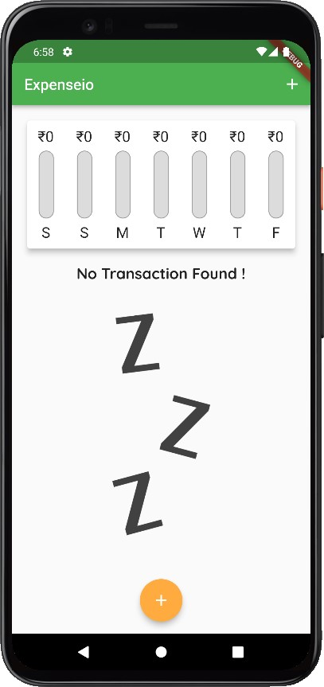
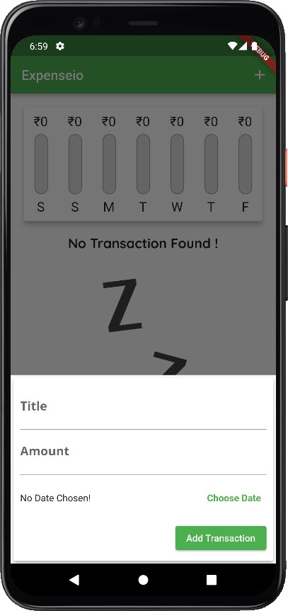
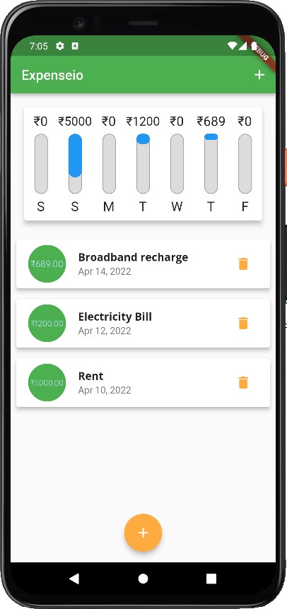

# Expenseio
> Personal Expense Manager for Mobile, Web and Desktop

<p align="center">
  
</p>

<p align="center"><ahref="https://github.com/subrotokumar/expenseio/releases">  </ahref=></p>
<p align="center">
<a href="https://github.com/subrotokumar/meme-explorer" alt="GitHub release"></a>
<hr>

## Screenshot 

<p align="center">
____
____

</p>

### Features
- Responsive to multiple sized screen
- Adaptive to Android's material UI and IOS's Cupertino UI.
- Chart View to view last 7 days transaction in grraphic view.
- Come with 'ADD' and 'Remove' transaction function.
- Available for Android, iOS, Windows, Linus, macOS.

### Tools and Dependencies used 

- Programming Language : **Dart**
- **Flutter**
- Android toolchain - develop for Android devices (**Android SDK version 31.0.0**)
- **Android Studio**

### Getting Started

You can build and run this by following these steps:

```bash
git clone https://github.com/subrotokumar/expenseio.git
cd expenseio
flutter run
```

## Contribution
Your ideas, translations, design changes, code cleaning, or real heavy code changes or any help is always welcome. The more is contribution the better it gets

[Pull requests](https://github.com/expenseio/pulls) will be reviewed
<!--
#### Known issues and limitations
-->


